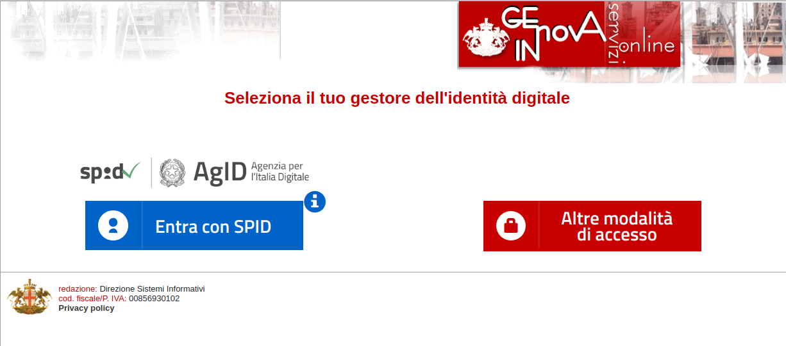
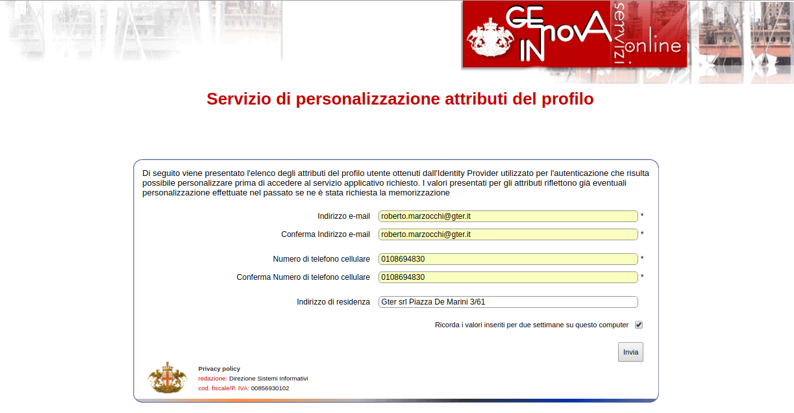
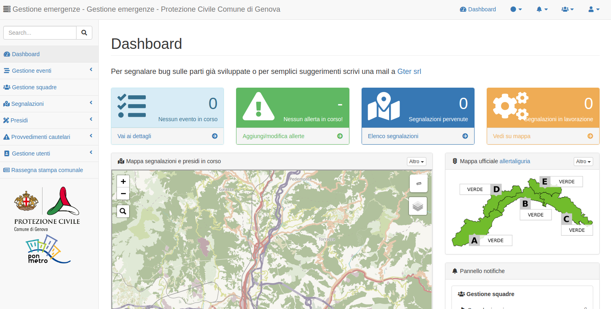

Modalità di accesso
====================

Chi può avere accesso al sistema
---------------------------------
Le modalità di accesso attualmente previste dal sistema sono:

* **dipendente comunale**: avviene inserendo matricola e password comunali
* **esterno**: avviene inserendo le proprie credenziali SPID

Le matricola e/o le credenziali SPID sono il criterio con cui accedere all'appllicativo. 
Dopodichè per visualizzare le informazioni e/o inserire nuove informazioni è necessario essere abilitati
dall'amministratore di sistema della protezione civile. 

L'amministratore di sistema ha la possibilità di associare un dipendente comunale o un utente esterno a 
un determinato profilo utente all'interno del Sistema e questo determina cosa l'utente può fare o meno
sull'applicativo stesso.

Come accedere al sistema
--------------------------

L'applicativo realizzato è web-based per cui si accede al sistema semplicemente tramite un link

In particolare, esistono due versioni dell'applicativo:

* **versione in esercizio**  `https://emergenze.comune.genova.it <https://emergenze.comune.genova.it>`_ accessibile via internet e da usare solo in emergenza in seguito ad un avviso della Protezione Civile
* **versione di test**  `https://gestemert.comune.genova.it <https://gestemert.comune.genova.it>`_ accessibile solo da rete comunale e utilizzabile per test ed esercitazioni anche in tempo di pace

L'accesso avviene tramite un applicativo dei Sistemi Informativi del Comune di Genova denominato SIRAC SSO (Single Sign On authentication)
appositamente implementato per l'accesso agli applicativi che richiedano una doppia modalità di autenticazione. Per
maggiori informazioni circa il seguente applicativo si rimanda ai Sistemi Informativi (test@comune.genova.it)

* **dipendente comunale**: Cliccando sul tasto rosso a destra compare un'unica opzione su cui cliccare "Altre modalità di accesso" 
ed è quindi necessario inserire le proprie matricola e password comunali

* **esterno**: Cliccando sul tasto blu a sinistra si visualizzano i vari provider SPID tra cui scegliere quello con le proprie credenziali e si verrà re-indirizzati sul sito del provider su cui inserire utente e password

**Nella sola versione di test**, una volta inseriti questi dati si arriva ad una seconda pagina implementata dai Sistemi Informativi del Comune di Genova in cui inserire
mail, numero di telefono e indirizzo. **I dati in questione non servono in nessun modo al sistema quindi non è necessario
inserire dati personali.**

Al termine si verrà re-indirizzati verso l'applicativo e, se autorizzati, si vedrà la prima pagina dell'applicativo.

Se non autorizzati all'acceso è necessario contattare gli amministratori di sistema come illustrato
nelle :ref:`richiesta-accesso`.

In caso di problemi tecnici di accesso si invita invece a contattare i Sistemi Informativi via mail applicazionisit@comune.genova.it o telefono XXXXXX.
