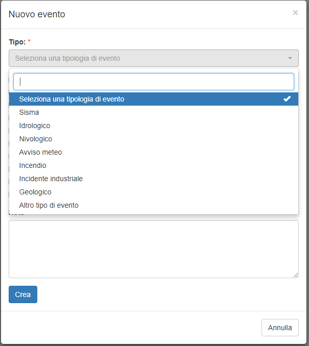
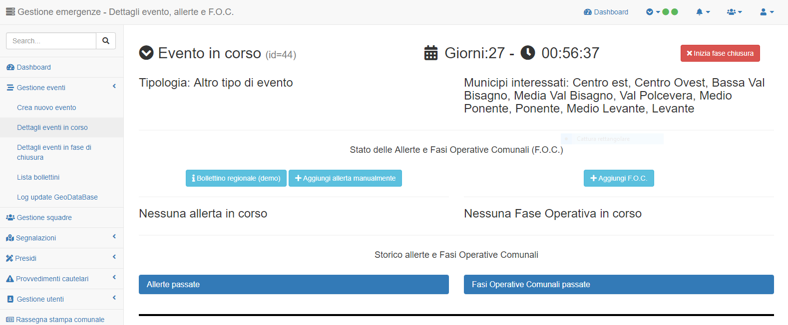
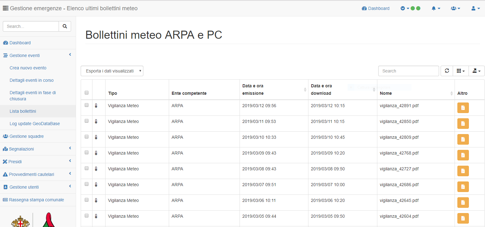

Funzionalità di gestione evento
===============================
Le funzionalità di creazione/gestione di eventi sono possibili solo per il profili di
tipo 1 e 2 (*Amministratore di sistema* e *Responsabile Centrale PC*).

Nuovo evento
------------
Si accede a tale funzionalità attraverso l'apposito menù a sinistra.

E' necessario specificare:

* il tipo di evento;
* il municipio o i municipi interessati dall'evento stesso.

Gestione evento in corso
-----------------------------------
Tramite questa pagina è possibile visualizzare:

* dettagli sull'evento in corso;
* dettagli sulle Allerte / Fasi Operative Comunali (F.O.C.) previste, in corso o passate.

Per gli amministratori di sistema è anche possibile aggiungere o modificare le informazioni sulle
Allerte / Fasi Operative Comunali in corso.

Visualizzazione bollettini ARPA e Regione
---------------------------------------------------
Tramite questa pagina è possibile visualizzare l'elenco dei bollettini che
sono scaricati in tempo reale dal sito http://allerta.liguria.gov.it
Per ogni bollettino è possibile visualizzare e se necessario scaricare il corrispondente PDF.

Gestione eventi in chiusura
---------------------------
Una volta che un evento si avvicina al termine naturale, la Protezione Civile
ha la facoltà di porre il suddetto evento in chiusura.

Una volta **in chiusura** non sarà possibile aggiungere nuove segnalazioni ma sarà sempre
possibile gestire le segnalazioni già inserite a sistema in maniera tale da chiuderle.

