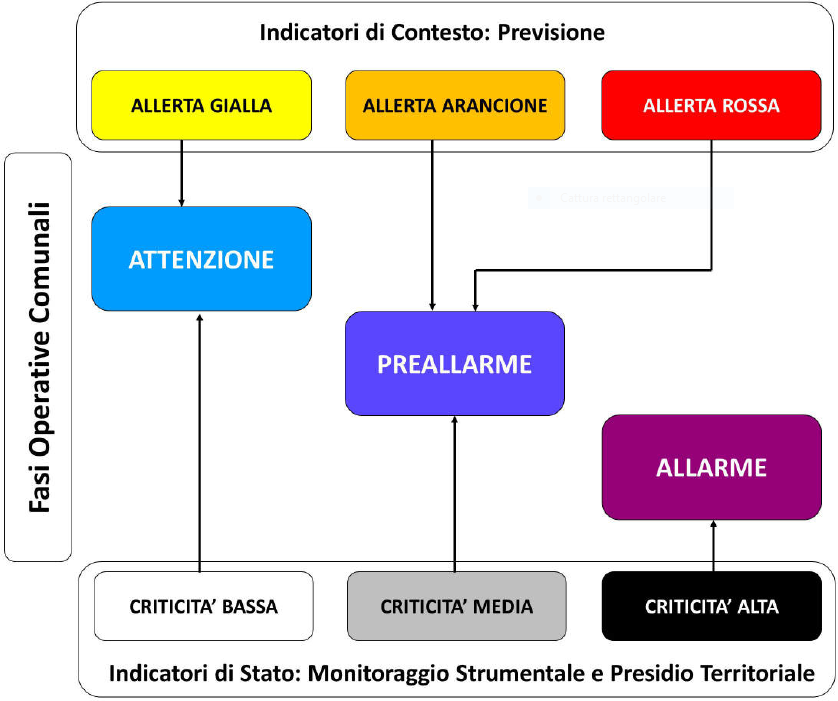

Glossario
==================

Evento
--------------------
L'**evento** è alla base del sistema.
Può essere previsto o in atto ed è la condizione necessaria per usare il sistema (inserire segnalazoni, creare sopralluoghi, etc.)
Con l'apertura di un evento si possono iniziare ad inserire informazioni a sistema, in assenza di un evento in corso non ? possibile utilizzare l'applicativo.

Dal punto di vista procedurale, l'apertura di un evento corrisponde alla convocazione del COC (Centro Operativo XXXX) e verr? 
comunicata a uffici periferici (municipi, distretti), direzioni e unit? operative esterne (AMIU, AMT ASter, etc) attraverso un contatto mail.
Importante a questo proposito comunicare a Protezione Civile eventuali variazioni alle mail di contatto.

Allerte e Fasi Operative Comunali
----------------------------------

L'evento non corrisponde ad un'allerta meteo, anche se frequentemente, almeno sul nostro territorio,
gli eventi possono essere aperti in previsione di un'allerta diramata dalla PC regionale.
In tal caso, un evento conterr? spesso diverse 
* **allerte** corrisponde a un avviso istituzionale (proveniente da ARPAL e Regione Liguria) 
che preannuncia il verificarsi di una situazione critica. possono essere

* gialla
* arancione
* rossa

Le **Fasi Operative Comunali (F.O.C.)** : spesso corrispondono alle allerte, ma non necessariamente
(es. crollo del ponte Morandi) ed è individuata dalla Protezione Civile Comunale sulla base delle criticit? associate
all'evento. Nel caso di evento meteo/idro le F.O.C. sono individuate dal seguente schema estratto dal manuale operativo comunale id Protezione
Civile

Segnalazione
---------------------

Le segnalazioni: possono pervenire dai cittadini:

* tramite numero verde comunale (Centrale PC)
* tramite numero della PM (Centrale COA)
* chiamando/recandosi presso i distretti di PM
* chiamando/recandosi presso i municipi

Oltre che dai cittadini possono pervenire anche da enti/associazioni/squadre presenti sul territorio.
Possono essere ricevute da quasi tutti i profili utente ed inseriti a sistema.
Possono essere gestite da una centrale PC / COA o da un ufficio periferico (municipio / distretto). 

Tendenzialmente gli uffici periferici potranno scegliere se gestire la segnalazione in autonomia
o far gestire la segnalazione della centrale di propria competenza che, per i municipi sarà la Centrale di PC
per i distretti la centrale COA (Centro Operativo. Automatizzato)
L'ufficio periferico ha in ogni momento la possibilit? di trasferire la titolarit? della segnalazione alla corrispondente centrale, non vale il contrario.

Possibili compiti (incarichi, presidi e provvedimenti cautelari)
-----------------------------------------------------------------
Durante la gestione delle segnalazioni l'ente che ne detiene la titolarità ha a disposizione:

* incarichi
* incarichi interni 
* presidi
* provvedimenti cautelari.

che saranno dettagliati nelle seguenti sezioni della presente guida in linea.
