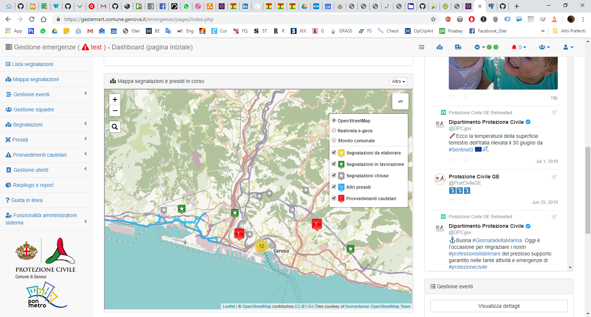

Introduzione
==================

Scopo del sistema di Gestione Emergenze
------------------------------------------

Da alcuni anni la Protezione Civile del Comune di Genova ha deciso di dotarsi di un proprio sistema informativo
per la gestione delle emergenze. In questo contesto, l’informazione territoriale gioca un ruolo fondamentale.

Si tratta di un applicativo web che permette la condivisione delle informazioni fra i vari soggetti sia interni
al Comune che esterni (volontari di protezione civile, aziende municipalizzate, VVF, Regione, etc) coinvolti
a vario titolo nella gestione delle emergenze e quindi di supportare le operazioni di gestione e mitigazione del rischio.
Tale sistema, inizialmente realizzato dal Comune di Genova con risorse interne quale replica di altri sistemi
informativi in dotazione all’Ente è stato recentemente completamente rinnovato grazie a dei finanziamenti
PON Metro 2014-2020.

Il nuovo sistema, realizzato da [Gter srl](https://www.gter.it), oltre ad aver subito un importante restyling grafico che,
a detta degli operatori di protezione civile, ha permesso di incrementarne sostanzialmente l’usabilità,
ha ora al centro l’aspetto territoriale.

Ogni segnalazione e/o intervento svolto è infatti georeferenziato grazie al collegamento con la toponomastica comunale.
Questo nuovo approccio permette di avere in ogni istante un quadro preciso di quanto sta avvenendo sul territorio e
pertanto di ottimizzare la gestione delle poche risorse a disposizione. Collegato alle banche dati territoriali,
non solo alla toponomastica, ma anche all’anagrafe, e ai principali elementi a rischio (rii, sottopassi etc),
il sistema permette di gestire e registrare interventi puntuali quali sgomberi o interdizioni all’accesso in maniera
sicura ed efficiente.

Descrizione dell'applicativo
------------------------------------------

Si tratta di un applicativo web ad accesso profilato le cui funzionalità verranno
illustrate in dettaglio nelle seguenti sezioni.

Le funzionalità di sistema sono accessibili dal menù a sinistra dell'interfaccia web,
mentre in alto compare un menù con le principali notifiche del sistema.

Nella prima pagina definita *dashboard* e sempre raggiungibile cliccando sia sul menù
a sinistra che sulla toolbar delle notifiche, si cerca di fornire a tutti gli utenti
un riepilogo sintetico di quanto sta accadendo sul territorio.
