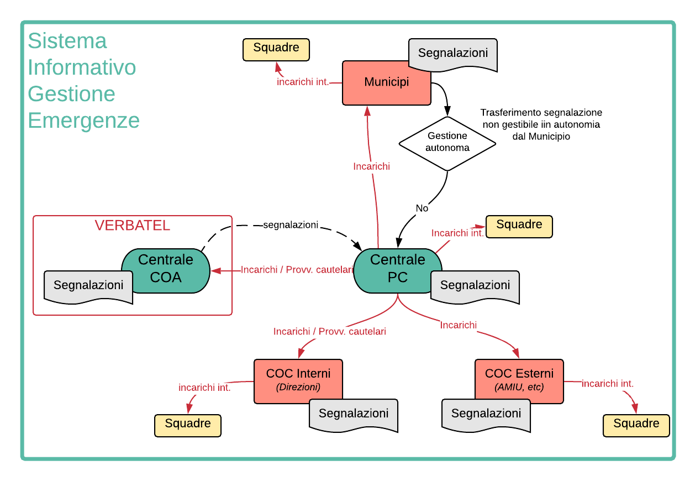

Schema di funzionamento
============================================

Lo schema di funzionamento del Sistema Informativo mostrato nella figura seguente.

Sinteticamente:

* le segnalazioni possono essere ricevute da tutti i soggetti in gioco:

  - PM e municipi possono gestirle in autonomia o inviarle alla PC
  - gli altri membri del COC (sia direzioni interne che aziende esterne) non possono gestirli in autonomia ma al contrario le girano tutte alla PC di default
  
* la PC può assegnare incarichi ai vari soggetti in gioco che possono essere accettati o rifiutati a seconda delle specifiche situazioni
* la PC può assegnare provvedimenti cautelari alle direzioni o alla PM che dovranno necessariamente essere eseguiti
* la PC può assegnare presidi e incarichi interni alle proprie squadre
* tutti i soggetti, qualora lo vogliano, possono assegnare incarichi interni alle proprie squadre

