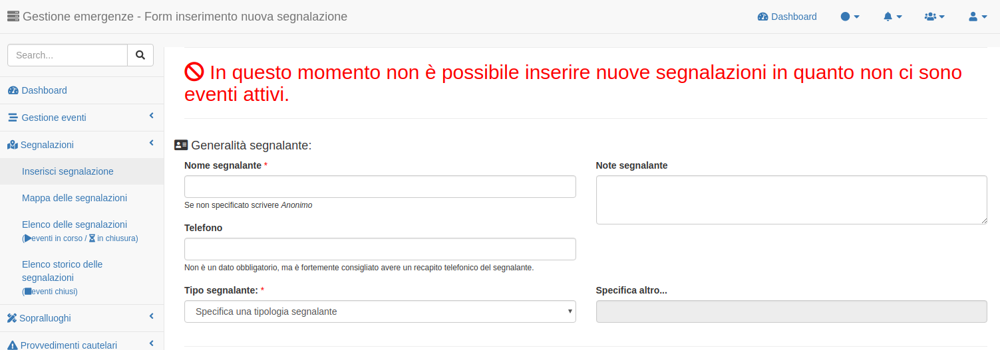
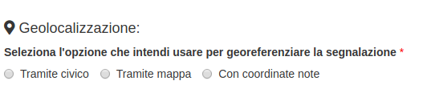
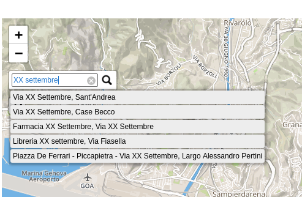
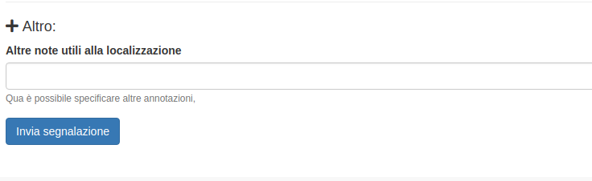
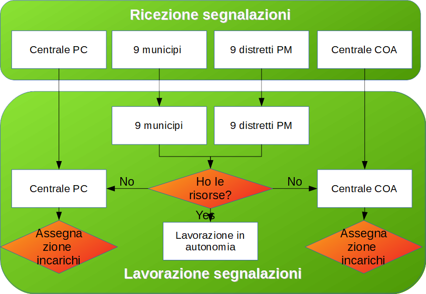
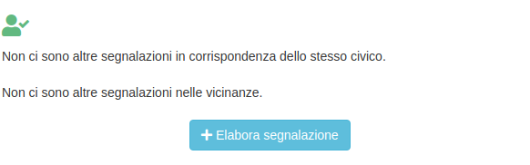
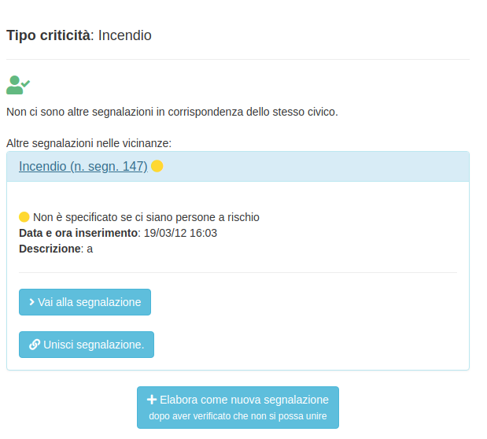

Gestione segnalazioni
=========================

Nuova segnalazione
-------------------------

Per inserire una nuova segnalazione è necessario cliccare sul menù a sinistra:
Gestione delle segnalazioni --> Nuova segnalazione

Per inserire una segnalazione è necessario che ci sia un evento attivo.
In caso contrario viene visualizzato un messaggio che avvisa l'utente dell'impossibilità
di inserire nuove segnalazioni.

Possono essere ricevute da quasi tutti i profili utente ed inseriti a sistema purché siano correttamente georeferenziate.
I campi indicati con l'asterisco sono quelli obbligatori e vanno necessariamentre inseriti nel caso in cui si voglia inserire a sistema una segnalazione,
tuttavia si consiglia il completamento di tuti i campi in cui si vogliano aggiungere informazioni aggiuntive.

Generalità del segnalante
''''''''''''''''''''''''''

Nella prima sezione vanno indicate le generalità del segnalante:

* Nome se conosciuto, altrimenti *Anonimo*
* Telefono
* Tipologia di segnalante da scegliere con un menù a tendina
* Eventuali note, quali per esempio giudizi sull'ansia/attendibilità del segnalante

Evento e tipologia criticità
'''''''''''''''''''''''''''''
Proseguendo bisogna indicare l'evento a cui si riferisce la segnalazione.
Nel caso in cui ce ne sia più di uno attivo scegliere l'evento tramite l'apposito menù a tendina.

Quindi è necesssario:

* specificare la tipologia di criticità tra quelle proposte nel menù a tendina
* aggiungere una descrizione ulteriore dell'evento (non necessario specificare qua la localizzazione)
* specificare se ci sono persone a rischio

Georeferenziazione della segnalazione
''''''''''''''''''''''''''''''''''''''
A questo punto si arriva alla sezione della **georeferenziazione** che prevede 3 possibilità fra loro esclusive.

	* Tramite civico
	* Tramite punto su mappa
	* Tramite coordinate note

Prima di tutto è necessario scegliere una modalità selezionando una fra le 3 caselle di controllo previste.

Una volta selezionata per esempio l'opzione *tramite civico* si attivano automaticamente i menù a tendina per la scelta
della via e dei civici corrispondenti che prendono i dati dal DB topocartografico del Comune di Genova. In questo caso la mappa non viene utilizzata e infatti di default rimane chiusa.

Selezionando invece la modalità *tramite mappa* i menù a tendina per la scelta della via restano disabilitati e si
apre la mappa su cui l'utente dovrà posizionare un puntatore clickando con il mouse sul punto desiderato della mappa.

E' possibile effettuare una ricerca sull'area di interesse per parole chiave attraverso il tasto in alto a sinistra
con una lente come mostrato nell'immagine seguente.

La terza ed ultima opzione *tramire coordinate note* è ovviamente quella che verrà utilizzata meno frequentemente in quanto prevede che vengano fornite dal segnalante le coordinate in gradi decimali (latitudine / longitudine), ad esempio tramite invio della posizione tramite servizio di posizionamento (whatsapp, telegram, geosms, etc).

Infine è possibile specificare ulteriori indicazioni utili a localizzare al meglio la segnalazione
(es. nei pressi della fermata dell'autobus XX direzione XXX, nei pressi del
palo della luce con codice xxxx, etc.)

Invio della segnalazione
''''''''''''''''''''''''''''''''''''''

Una volta completata la fondamentale fase di georeferenziazione della segnalazione
è infine necessario cliccare sul tasto *Invia la segnalazione* presente a fondo pagina

Presa in carico della segnalazione
---------------------------------------
Una volta inviata la segnalazione è necessario che qualcuno la prenda in carico.
In assenza della presa in carico comparirà una notifica di sistema che avvisa
l'utente della presenza di segnalazioni non ancora prese in carico.

Il flusso con cui avviene la gestione delle segnalazioni è il seguente:

Localizzazione altre segnalazioni nelle vicinanze e presa in carico
'''''''''''''''''''''''''''''''''''''''''''''''''''''''''''''''''''''
In generale il sistema segnala la presenza di altre segnalazioni nelle
vicinanze (stesso civico e/o entro un raggio di 200 m dalla nuova segnalazione).

Nessuna segnalazione nelle vicinanze
*****************************************

Se non ci sono segnalazioni comparirà un unico tasto attraverso il quale è possibile
elaborare la segnalazione prendendola in carico oppure, almeno nel caso di enti
periferici quali *municipi* o *distretti di PM*, cedere la titolarità della segnalazione
alla corrispondente centrale operativa (*Centrale di PC* per i municipi e *Centrale COA*
per i distretti di PM).

Altra segnalazione nelle vicinanze
*****************************************

Qualora invece ci siano segnalazioni nelle vicinanze è possibile elaborare la segnalazione
come se fosse una nuova segnalazione o unire le segnalazioni in modo da
ottimizzare il flusso di lavoro.
