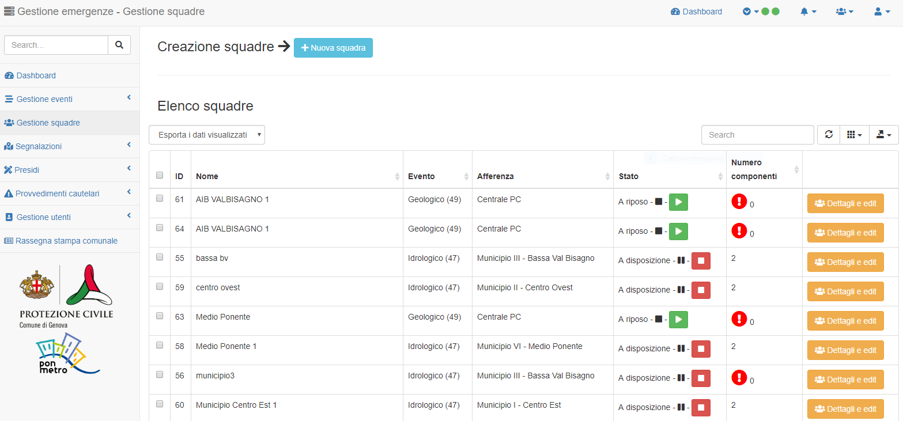

Funzionalità Telegram
==========================

Per utilizzare le funzionalità del Bot Telegram **Gestione emergenze comune di Genova** (@emergenze_genova_bot) è necessario essere un utente del Sistema Emergenze ed avere un profilo assegnato. 
Inoltre è necessario attivare le notifiche Telegram secondo quanto indicato nel capitolo `Profilo utente e attivazione notifiche telegram <accesso.html#profilo-utente-e-attivazione-notifiche-telegram>`__

Comandi Telegram
-------------------------------------------
Tramite questa scheda è possibile visualizzare e gestire le varie squadre.
Le squadre possono essere composte da personale esterno, preventivamente registrato a sistema
tramite la Protezione Civile comunale, o da dipendenti comunali.

Con il tasto in alto è possibile creare una nuova squadra, assegnandoli un nome.
Dalla tabella, cliccando sul tasto *Dettaglio ed edit* è possibile visualizzare le informazioni di massima sulla squadra e
modificarne la composizione.

Funzioni Telegram
-------------------------------------------

Rileva Presenza
''''''''''''''''''''''''''''''''''''''''''''''

Accettazione/rifiuto incarichi interni, incarichi e presidi
''''''''''''''''''''''''''''''''''''''''''''''''''''''''''''

Inserimento lettura mire
'''''''''''''''''''''''''''''''''''''''''''''''

Comunicazioni con la centrale operativa
'''''''''''''''''''''''''''''''''''''

