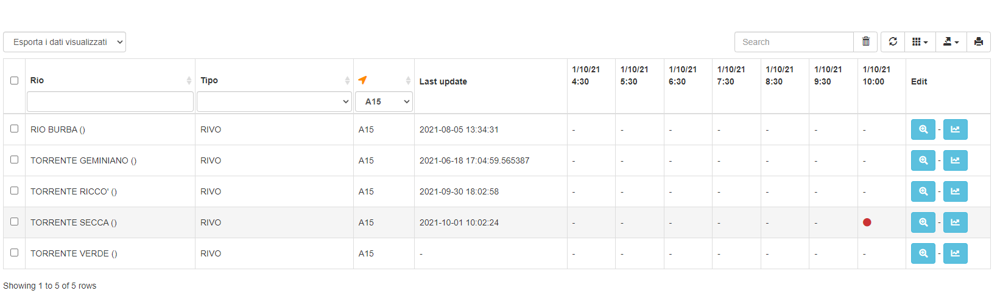

Funzionalità BOT Telegram Gestione Emergenze Comune di Genova
=============================================================

Per utilizzare le funzionalità del Bot Telegram **Gestione emergenze Comune di Genova** (@emergenze_genova_bot) è necessario essere un utente del Sistema Emergenze ed avere un profilo assegnato. 
Inoltre è necessario attivare le notifiche Telegram secondo quanto indicato nel capitolo `Profilo utente e attivazione notifiche telegram <accesso.html#profilo-utente-e-attivazione-notifiche-telegram>`__

Tramite il bot Telegram è possibile ricevere notifiche dal Sistema Emergenze, ad esempio in caso di apertura di un nuovo evento, di assegnazione di un incarico/presidio alla propria squadra, ecc. Inoltre è anche possibile interagire direttamente con il Sistema Emergenze ad esempio segnalando la propria presenza alla Centrale Operativa, accettando o rifiutando un incarico assegnato alla propria squadra, inserendo la lettura di una mira o inviando una comunicazione alla Centrale.

.. warning:: E' fondamentale per il corretto funzionamento del bot rispettare e seguire tutti i passaggi richiesti dai comandi e nell'ortdine indicato per poterli eseguire correttamente. Qualora non venissero esguiti tutti gli step, il comando non viene terminato e quindi gli altri comandi/funzioni del bot non potranno essere utilizzati fino al completamento del comando.

Comandi Telegram
-------------------------------------------
Una volta installato il bot su Telegram è possibile accedere ai diversi comandi sviluppati. La lista dei comandi disponibili è accessibile cliccando sul pulsante **Menu** nella barra degli strumenti dell'applicazione Telegram oppure digitando il simbolo slash **/**

.. image:: img/barra_t.png
  :align: center

I comandi disponibili sono:

* **/start** - avvia il bot per la prima volta e viene automaticamente lanciato all'installazione del bot
* **/help** - restituisce un messaggio con una breve descrizione dei comandi del bot
* **/telegram_id** - restituisce il proprio codice identificativo Telegram. Questo codice univoco deve essere inserito nel Sistema per consentire l'attiovazione delle notifiche
* **/sito** - restituisce il link web al Portale di Sistema Emergenze
* **/registra_presenza** - consente all'utente di registrare a sistema la propria presenza ad inizio turno (per maggiori dettagli si veda il paragrafo :ref:`registra-presenza`)
* **/registra_uscita** - consente all'utente di registrare a sistema la fine del proprio turno (per maggiori dettagli si veda il paragrafo :ref:`registra-presenza`)
* **/inserisci_mira** - consente di inserire il valore della lettura di una mira (per maggiori dettagli si veda il paragrafo :ref:`lettura-mira`)
* **/comunicazione** - consente di inviare una comunicazione (testo ed eventuali immagini) relativa a una segnalazione alla Centrale operativa (per maggiori dettagli si veda il paragrafo :ref:`comunicazioni`)

  
I comandi possono essere lanciati con tre modalità:

* cliccando sul comando desiderato dalla lista dei comandi che si ottiene con il pulsante **Menu**
* cliccando sul comando desiderato dalla lista dei comandi che si ottiene digitando il simbolo **/**
* digitando il nome del comando preceduto da simbolo slash **/**

.. image:: img/comandi_t2.png
  :align: center

Funzioni Telegram
-------------------------------------------

.. _registra-presenza:

Registra Presenza
''''''''''''''''''''''''''''''''''''''''''''''
La funzionalità **Registra presenza** consente all'utente di indicare l'inizio e la fine del proprio turno. 

Il comando **/registra_presenza**, disponibile nella lista dei comandi, consente di indicare l'inizio del proprio turno. Il comando restituisce all'utente un messaggio in cui viene chiesto di specificare la durata del turno, l'utente dovrà quindi cliccare sul bottone corrispondente al numero di ore del turno

.. image:: img/presenza_durata.png
  :align: center
  
Una volta indicata la durata del proprio turno, il bot restituisce un messaggio di avvenuta registrazione della presenza e l'indicazione dell'orario presunto di fine turno

.. image:: img/presenza_ok.png
  :align: center
  
.. warning:: Qualora fosse già stata indicata la propria presenza tramite il comando **/registra_presenza**, il bot restituirà un messaggio che informa l'utente che la presenza è già stata registrata.

Il comando **/registra_uscita**, disponibile nella lista dei comandi, consente di indicare la fine del proprio turno. Il comando restituisce all'utente un messaggio in cui viene chiesto di confermare la chiusura del turno

.. image:: img/registra_uscita.png
  :align: center

.. warning:: Qualora fosse già stata indicata la fine del proprio turno tramite il comando **/registra_uscita**, il bot restituirà un messaggio che informa l'utente che non risulta a sistema un tunro attivo.

A partire da 10 minuti prima dell'ora presunta di fine turno, l'utente riceverà una notifica automatica di remind sul bot per ricordare di utilizzare il comando **/registra_uscita** per indicare la fine del turno. L'utente riceverà una notifica ogni 10 minuti finchè non verrà chiuso il turno

Ricezione della presenza sul Sistema Emergenze 
*************************************************

Quando l'operatore registra la propria presenza tramite il comando **/registra_presenza** del bot Telegram, i dettagli del suo turno saranno visibili sulla pagina web **Utenti presenti** del Sistema Emergenze. Oltre ai dati dell'utente (matricola/CF, nome e cognome) sono indicati anche data e ora di inizio turno e la durata del turno. Gli utenti del Sistema con profilo **Amministratore** possono dalla pagina **Utenti presenti**:

* chiudere il turno di un operatore utilizzando il bottone **Termina Turno** 
* modificare i dettagli (inizio e durata) del turno di un operatore utilizzando il bottone **Modifica Turno**

.. image:: img/presenti.png
  :align: center
  
Quando il turno di un operatore viene terminato, utilizzando il comando **/registra_uscita** del bot Telegram o dall'Amministratore di Sistema, i dettagli del turno appena chiuso saranno visibili nella pagina web **Storico utenti presenti** del Sistema Emergenze.

La presenza degli operatori è visibile anche sulla pagina web **Gestione squadre**. Nella tabella delle squadre attive o attivabili, la colonna **Telegram** indica se il Capo squadra ha registrato la propria presenza:

* icona X arancione = è stato assegnato un Capo squadra ma non ha registrato la propria presenza
* icona V verde = è stato assegnato un Capo squadra e ha registrato la propria presenza
* '-' = non è stato assegnato un Capo squadra

.. image:: img/presenza_squadre.png
  :align: center

Accettazione/rifiuto incarichi interni, presidi e incarichi
''''''''''''''''''''''''''''''''''''''''''''''''''''''''''''

Durante la gestione di una segnalazione registrata sul Sistema Emergenze, l'ente che ne detiene la titolarità ha la possibilità di assegnare incarichi interni e presidi fissi alle squadre attivabili o incarichi a Direzioni, Municipi, Distretti di PM e Unità Operative Esterne. Questa funzione gestisce anche l'accettazione o il rifiuto di presidi fissi assegnati a una squdara indipendentemente da una segnalazione.

* Quando viene assegnato un **incarico interno o un presidio fisso** il Sistema Emergenze **invierà una notifica sul bot Telegram** a tutti gli operatori facenti parte della **squadra** a cui è stato assegnato l'incarico interno/presidio fisso. In questo caso è possibile per gli operatori gestire l'accettazione o il rifiuto dell'incarico/presidio direttamente dal bot Telegram.
* Quando viene assegnato un **presidio mobile** il Sistema Emergenze **invierà una notifica sul bot Telegram** a tutti gli operatori facenti parte della **squadra** a cui è stato assegnato il presidio mobile. In questo caso viene solamente inviata la notifica e **non è possibile** per gli operatori gestire l'accettazione del presidio direttamente dal bot Telegram.
* Quando viene assegnato un **incarico** il Sistema Emergenze **invierà una notifica sul bot Telegram** ai contatti registrati a sistema per la notifica degli incarichi a Direzioni, Municipi, Distretti di PM e Unità Operative Esterne. In questo caso viene solamente inviata la notifica e **non è possibile** per gli operatori gestire l'accettazione o il rifiuto dell'incarico direttamente dal bot Telegram.

.. note:: E' buona norma che l'accettazione/rifiuto dell'incarico o presidio venga gestita via Telegram dal Capo squadra. In ogni caso qualora un componente accettasse l'incarico/presidio, non sarà possibile per gli altri componenti della squadra rifiutarlo o accettarlo nuovamente.

Accettazione/rifiuto incarichi interni
***************************************

In caso di assegnazione di un incarico interno a una squadra, tutti gli operatori facenti parte della squadra riceveranno una notifica di assegnazione incarico sul bot Telegram con indicato:

* il numero della segnalazione a cui fa riferimento l'incarico
* il nome della squadra di appartenenza
* i dettagli dell'incarico (breve descrizione operativa)
* le istruzioni per accettare o rifiutare l'incarico
* una mappa con la geolocalizzazione dell'incarico (cliccando sulla mappa si viene reindirazzati allo strumento per la ricerca delle indicazioni stradali)

.. image:: img/notifica_inc_int.png
  :align: center
  

L'operatore può **accettare** l'incarico con due modalità:

* cliccando sul comando **/accetto** direttamente dal messaggio di notifica ricevuto
* digitando il comando **/accetto** nell'area di testo di Telegram

La funzione di accettazione dell'incarico assegnato è composta dai seguenti step:

* comando **/accetto** - restiruisce un messaggio sul bot in cui viene chiesto all'operatore di indicare tra quanti minuti sarà sul posto.
* invio del messaggio da parte dell'operatore con indicazione il numero di minuti espresso in cifre (es. 20). **NB.** Se il numero di minuti viene espresso in caratteri (es. venti) il bot restituirà un messaggio di errore e sarà necessario indicare nuovamente i minuti in cifre.
* indicazione da parte dell'operatore se la presa in carico è regolare o parziale cliccando sui bottoni che compaiono nella barra degli strumenti di telegram

Conclusi questi tre step, l'operatore riceverà un messaggio di riepilogo con quanto indicato negli step recedenti e le istruzioni per chiudere l'incarico una volta completato

.. image:: img/accetto_inc_int.png
  :align: center
  
L'operatore può successivamente **chiudere** l'incarico con due modalità:

* cliccando sul comando **/chiudo** direttamente dal messaggio di notifica ricevuto terminata la funzione di accettazione dell'incarico
* digitando il comando **/chiudo** nell'area di testo di Telegram

La funzione di chiusura dell'incarico assegnato è composta dai seguenti step:

* comando **/chiudo** - restiruisce un messaggio sul bot in cui viene chiesto all'operatore di indicare una nota di chiusura
* invio del messaggio da parte dell'operatore con un breve testo di nota per la chiusura

  
Oltre ad accettare/chiudere l'incarico è possibile anche dal bot telegram **rifiutare** l'incarico.

L'operatore può **rifiutare** l'incarico con due modalità:

* cliccando sul comando **/rifiuto** direttamente dal messaggio di notifica ricevuto all'assegnazione dell'incarico
* digitando il comando **/rifiuto** nell'area di testo di Telegram

La funzione di rifiuto dell'incarico assegnato è composta dai seguenti step:

* comando **/rifiuto** - restiruisce un messaggio sul bot in cui viene chiesto all'operatore di indicare una motivazione per il rifiuto
* invio del messaggio da parte dell'operatore con un breve testo di motivazione per il rifiuto

  

.. warning:: I comandi **/accetto, /chiudo e /rifiuto** funzionano solo se l'operatore è parte di una squadra e se a quella squadra è stato assegnato un incarico. Quando l'operatore lancia uno di questi comandi il bot verifica se l'operatore è inserito in una squadra e se ad essa è assegnato un incarico interno, qualora queste condizioni non fossero verificate, il bot restituisce un messaggio di errore.

Accettazione presidio fisso
***************************************

In caso di assegnazione di un presidio fisso a una squadra, tutti gli operatori facenti parte della squadra riceveranno una notifica di assegnazione presidio sul bot Telegram con indicato:

* il numero della segnalazione a cui fa riferimento il presidio
* il nome della squadra di appartenenza
* i dettagli del presidio (breve descrizione operativa)
* le istruzioni per accettare il presidio (nel caso dei presidi non è previsto il rifiuto)
* una mappa con la geolocalizzazione del presidio (cliccando sulla mappa si viene reindirazzati allo strumento per la ricerca delle indicazioni stradali)

.. image:: img/notifica_pres_fis.png
  :align: center
  

L'operatore può **accettare** il presidio fisso con due modalità:

* cliccando sul comando **/presidio** direttamente dal messaggio di notifica ricevuto
* digitando il comando **/presidio** nell'area di testo di Telegram

La funzione di accettazione del presidio assegnato è composta dai seguenti step:

* comando **/presidio** - restiruisce un messaggio sul bot in cui viene chiesto all'operatore di indicare tra quanti minuti sarà sul posto.
* invio del messaggio da parte dell'operatore con indicazione il numero di minuti espresso in cifre (es. 20). **NB.** Se il numero di minuti viene espresso in caratteri (es. venti) il bot restituirà un messaggio di errore e sarà necessario indicare nuovamente i minuti in cifre.

Conclusi questi due step, l'operatore riceverà un messaggio di riepilogo con quanto indicato negli step recedenti e le istruzioni per chiudere il presidio una volta completato

.. image:: img/accetto_pres_fis.png
  :align: center
  
L'operatore può successivamente **chiudere** il presidio con due modalità:

* cliccando sul comando **/stop** direttamente dal messaggio di notifica ricevuto terminata la funzione di accettazione del presidio
* digitando il comando **/stop** nell'area di testo di Telegram

La funzione di chiusura del presidio assegnato è composta dai seguenti step:

* comando **/stop** - restiruisce un messaggio sul bot in cui viene chiesto all'operatore di indicare una nota di chiusura
* invio del messaggio da parte dell'operatore con un breve testo di nota per la chiusura

.. image:: img/chiudo_pres_fis.png
  :align: center
  

.. warning:: I comandi **/presidio e /stop** funzionano solo se l'operatore è parte di una squadra e se a quella squadra è stato assegnato un presidio. Quando l'operatore lancia uno di questi comandi il bot verifica se l'operatore è inserito in una squadra e se ad essa è assegnato un presidio fisso, qualora queste condizioni non fossero verificate, il bot restituisce un messaggio di errore.

.. _lettura-mira:

Inserimento lettura mire
'''''''''''''''''''''''''''''''''''''''''''''''

La funzionalità **Inserimento lettura mira** consente di inserire le letture delle mire sui corsi d'acqua.

.. warning:: Il comando **/inserisci_mira** può essere utilizzato solo nei casi in cui è attiva una **Fase Operativa Comunale (FOC)** e solo dai componenti della squadre a cui sono assegnati dei **presidi mobili**. Qualora non fosse verificata una di queste condizioni, il comando restiuirà un messaggio di errore.  

Il comando **/inserisci_mira**, disponibile dalla lista dei comandi, restituisce l'elenco delle mire relative al presidio mobile (percorso) assegnato alla squadra. L'operatore dovrà quindi cliccare sulla mira per cui vuole inserire la lettura.

  
Una volta indicata la mira, il bot restituisce un messaggio in cui si chiede all'operatore di inserire la lettura. Per inerire la lettura sono disponibili 3 bottoni (verde, giallo e rosso) reggiungibili cliccando sul pulsante evidenziato in verde nell'immagine sotto

  
L'operatore dovrà quindi cliccare sul bottone corrispondente alla lettura della mira scelta 

Una volta indicata la lettura della mira, il bot restituisce un messaggio di riepilogo dei dati inseriti e la lettura così inviata sarà immediatamente visibile nella pagine web **Mire sui corsi d'acqua** del Sistema emergenze

.. _comunicazioni:

Comunicazioni con la centrale operativa
'''''''''''''''''''''''''''''''''''''

La funzionalità **Comunicazioni con la centrale operativa** consente di inviare comunicazioni (testo e immagini) alla Centrale Operativa che recepirà tali comunicazioni tramite il portale web di Sistema Emergenze.

.. warning:: Il comando **/comunicazione** può essere utilizzato solo dai componenti della squadre a cui sono assegnati dei **incarichi interni, presidi fissi (relativi a una segnalazione), o presidi mobili**. Qualora non fosse verificata una di queste condizioni, il comando restiuirà un messaggio di errore.  

Il comando **/comunicazione**, disponibile dalla lista dei comandi, restituisce un messaggio in cui si chiede all'operatore di inserire il testo della comunicazione. L'operatore dovrà quindi digitare il testo e inviarlo. Una volta inviato il testo, il bot restituisce un messaggio in cui si chiede se si vuole inserire una foto 

La funzione di comunicazione con la centrale operativa è composta dai seguenti step:

* comando **/comunicazione** -  restituisce un messaggio in cui si chiede all'operatore di inserire il testo della comunicazione.
* invio del messaggio da parte dell'operatore con il testo
* indicazione da parte dell'operatore se desidera allegare un'immagine o inviare il solo testo inserito cliccando sui bottoni che compaiono nella barra degli strumenti di telegram. 

.. image:: img/comunicazione.png
  :align: center

Se viene scelto il tasto **Foto** l'operatore dovrà scattare una foto dal suo dispositivo o sceglierne una dalla gallerie immagini del dispositivo. Entrambe le opzioni sono raggiungibili cliccando sul tasto evidenziato in verde nell'immagine sotto

  
Conclusi questi tre step, l'operatore riceverà un messaggio conferma di avvenuto invio della comunicazione

La comunicazione sarà quindi immediatamente visibile sul portale web Sistema Emergenze nella pagina relativa all'incarico interno, presidio fisso o mobile.

  
    
  
 .. _botcoc: 
  
Funzionalità BOT Telegram Convocazione COC Genova (Paragrafo in fase di compilazione)
=================================================

Per utilizzare le funzionalità del Bot Telegram **Convocazione COC Genova** (@emergenze_genova_bot) non è necessario essere un utente del Sistema Emergenze con un profilo assegnato, ma è necessario essere registrato a sistema con membro del COC Direttivo. 

Tramite il bot Telegram è possibile ricevere notifiche dal Sistema Emergenze, ad esempio in caso di emanazione di un'allerta e in caso di convocazione del COC.

.. warning:: E' fondamentale per il corretto funzionamento del bot rispettare e seguire tutti i passaggi richiesti dai comandi e nell'ortdine indicato per poterli eseguire correttamente. Qualora non venissero esguiti tutti gli step, il comando non viene terminato e quindi gli altri comandi/funzioni del bot non potranno essere utilizzati fino al completamento del comando.

Notifica di emanazione di un'allerta
--------------------------------------

Sistema Emergenze riceve in tempo quasi reale i bollettini emessi da ARPAL (https://allertaliguria.regione.liguria.it/). All'emissione del bollettino, viene inviata da Sistema Emergenze una notifica sul BOT Telegram a tutti i componenti del COC Direttivo. Il messaggio di notifica contiene:

* il link pe la consultazione del bollettino appena emesso
* la comunicazione dell'emanazione dell'allerta
* il bottone per inviare al Sistema la conferma di lettura del messaggio 

L'utente deve cliccare sul pulsante ok mostrato nell'immagine sopra per inviare a Sistema Emergenze la conferma di lettura del messaggio. 

.. warning:: Qualora l'utente non invii la conferma di lettura, riceverà **ogni 5 minuti** una notifica di remind di invio della conferma di lettura 

I dettagli relativi all'invio del bollettino e della relativa conferma di lettura da parte dell'utente, sono visibili agli utenti amministratori tramite alle pagine web dedicate su Sistema Emergenze (si veda sezione dedicata :ref:`convocazione`)

Notifica di Convocazione del COC
----------------------------------------

* Invio convocazione COC da Sistema Emergenze
* Conferma di lettura
* remind invio conferma di lettura

.. _convocazione: 

Convocazione del COC da Sistema Emergenze e gestione dello storico
--------------------------------------------------------------------

* pagina convocazione COC 
  * tabella ultima convocazione con visualizzazione delle conferme di lettura
  * pulsante per invio convocazione
* pagina storico convocazione COC

Gestione utenti del COC da Sistema Emergenze
------------------------------------------------
