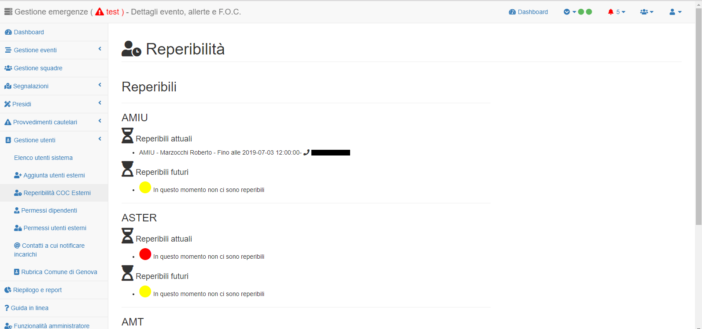
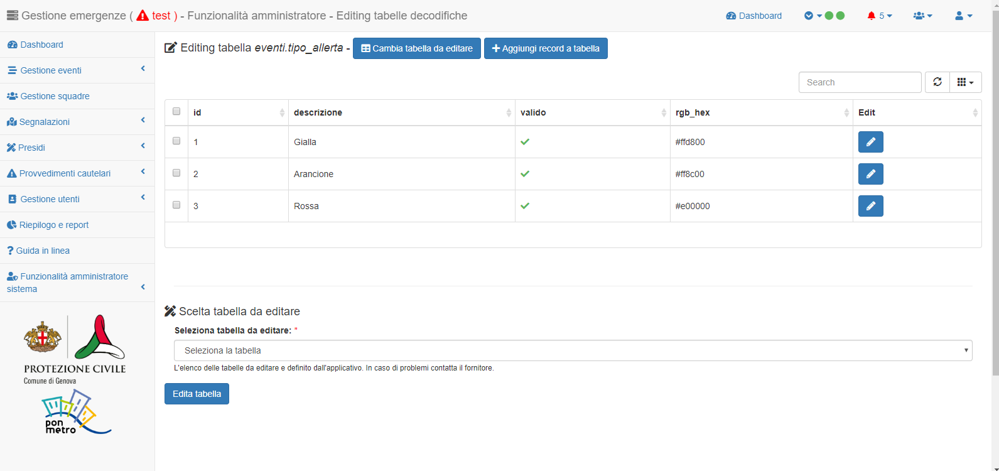

Funzionalità di gestione utenti
================================

Si tratta di quelle funzionalità utili per:

* creare nuovi utenti esterni;
* gestire le reperibilità;
* assegnare permessi a *utenti esterni* e  *dipendenti* (per i soli amministratori di sistema);
* gestire i contatti a cui notificare le mail (per i soli amministratori di sistema).

Funzionalità di creazione utenti esterni
-------------------------------------------------------------

Le funzionalità di creazione degli utenti avvengono tramite un apposito form che
replica il modulo cartaceo attualmente usato dalla Protezione Civile per la
registrazione dei volontari e, potrà essere condiviso con enti ed uffici
periferici, se necessario, per consentire una più agevole registrazione
degli utenti esterni.

.. image:: img/form_nuovo_utente.PNG

Una volta registrati a sistema, gli utenti **non avranno nessun tipo di accesso al sistema**
in quanto la gestione dei permessi utente è in carico ai soli amministratori di sistema e
verrà spiegata nelle seguenti sezioni.

.. _richiesta-accesso:

Richiesta di accesso / rimozione permessi
-------------------------------------------------------------
Per la richiesta di accesso è necessario inviare una mail all' `amministratore di sistema`_  per richiedere l'attivazione del profilo utente. 

.. _amministratore di sistema: adminemergenzepc@comune.genova.it

Per tutti i richiedenti è necessario specificare:

* nome
* cognome
* CF 
* affiliazione

**Si ricorda che per gli utenti esterni è necessaria la registrazione utente (previo accreditamento con SPID) tramite la  `seguente pagina`_ 

.. _seguente pagina: https://emergenze.comune.genova.it/pages/add_volontario.php**

.. _amministratore di sistema: adminemergenzepc@comune.genova.it

Reperibilita'
------------------------------------------------------------

In assenza del sistema informativo, ogni azienda partecipata comunicava alla PC la reperibilità del proprio personale tramite specifiche mail
che venivano opportunamente protocollate dalla PC. 
Con il nuovo sistema si propone di **inserire le reperibilità direttamente sul sistema** tramite le apposite funzionalità. 

Per l'aggiunta delle reperibilità si può utilizzare l'apposita pagina richiamabile: 

* dalla barra a sinistra all'interno del menù "Gestione utenti"
* dalla toolbar in alto dove, chi accede con un profilo "esterno" trova un tasto apposito per accedere alle reperibilità come mostrato nell'immagine sottostante.

Nella pagina delle reperibilità: 

* l'utente esterno:

	- può visualizzare le reperibilità già registrate a sistema dei propri colleghi. 
	
	.. image:: img/reperibilita_azienda0.PNG
	
	- deve inserire la reperibilità propria o dei suoi colleghi specificando data e ora di inizio e fine;
	
	.. image:: img/reperibilita_azienda1.PNG

* il personale di Protezione Civile può invece visualizzare le reperibilità già registrate a sistema di tutte le aziende partecipate e, in assenza di dati registrati sollecitare l'invio di detti dati tramite una mail automatica.

Assegnare permessi a *utenti esterni* e  *dipendenti*
-------------------------------------------------------------

Per assegnare/rimuovere i permessi ad un dipendente o ad un utente esterno è sufficiente:

* selezionare l'apposito tasto nel menù a sinistra;
* cercare la persona cui assegnare i permessi tramite nome e cognome;

* assegnare / rimuovere il profilo corrispondente a quella persona (es. personale del municipio XY)

.. image:: img/edit_profilo1.PNG

Gestire i contatti a cui notificare le mail
-------------------------------------------------------------

Per ogni unità operativa cui assegnare incarichi è necessario specificare una o più mail cui verranno
inviate le notifiche di sistema (vedi sopra).
Gli amministratori di sistema dovranno aggiornare i dati tramite l'apposita tabella di sistema.
Per ogni Unità Operativa si possono associare una o più mail.

**E' molto importante verificare periodicamente che i contatti mail inseriti a sistema siano aggiornati per evitare
falle nelle comunicazioni**.

Funzionalità *amministratore di sistema*
===========================================

Si tratta di due ulteriori pagine dell'applicativo, accessibili ai soli amministratori di sistema che consentono: 

* visualizzare ed editare le tabelle con le decodifiche usate nel sistema informativo; 
* visualizzare lo stato del travaso automatico che avviene ogni notte dalle banche dati comunali al sistema informativo.

Visualizzazione ed editing tabelle decodifiche
-------------------------------------------------------------

Si tratta della pagina con cui si possono in sostanza governare tutti gli elenchi a discesa usati dal sistema.

Tali elenchi a discesa sono infatti governati sostanzialmente da una serie di tabelle con le decodifiche usate dal sistema.

Tramite questa pagina è possibile editare dette tabelle.

Come primo step è necessario scegliere la tabella da editare da un'opportuno elenco a discesa. Si tratta in questo caso dell'unico elenco a discesa
non modificabile dall'amministratore di sistema, ma da personale dei sistemi informativi o dal fornitore. 

Una volta scelta una tabella si visualizzano i dati presenti 

e si possono eseguire le seguenti operazioni: 

* editing record;

* aggiunta nuovo record; 

**Non  è invece possibile rimuovere record, ma solo agire sul o sui campi vero/falso (normalmente si tratta del campo chiamato *valido*) 
per non mostrarli negli elenchi a discesa**

Visualizzare lo stato del travaso notturno
----------------------------------------------------------------

Anche se il sistema è ospitato nella rete comunale, per migliorare le performance, è utile che alcuni dati, in particolare l'**anagrafe**
e la **toponomastica**, siano già contenuti nel sistenma per migliorare le performance di accesso al sistema stesso. Per tale ragione,
è già stata implementata un attività che automaticamente, ogni notte, esegue il trasferimento di alcune informazioni dalla banche dati comunali
a quelle interne al sistema di gestione emergenze. 

Attraverso questa pagina si può:
* controllare che non siano avvenuti errori (da segnalare prontamente ai sistemi informativi);
* lanciare un update manuale del sistema (*!ATTENZIONE!: è un'attività che potrebbe rallentare il sistema, si consiglia di evitare in fase di emergenza*)

Quali sono in compiti dell' *amministratore di sistema*?
==========================================================
* L'amministratore di sistema deve ricordarsi che il sistema test e quello in esercizio sono due sistemi distinti. Quindi le modifiche all'uno devono essere
replicate sull'altro per essere realmente visibili.*

In sintesi si riepilogano quelli che sono i compiti / possibilità dell'amministratore di sistema: 

* l'amministratore di sistema è colui che detiene il controllo dell'accesso ai due sistemi (test ed esercizio) e può in ogni momento:
	* assegnare permessi ai dipendenti così come agli utenti esterni registrati
	* rimuovere i permessi
	
* l'amministratore di sistema è colui che tiene la rubrica dei contatti a cui notificare gli incarichi (mail)

* l'amministratore di sistema detiene i rapporti con le aziende esterne (contatti anche esterni al sistema)

* l'amministratore di sistema ha accesso alle tabelle di decodifica (quelle che governano gli elenchi a discesa)

* l'amministratore di sistema può forzare l'update delle informazioni anagrafiche e toponomastiche sul sistema (con cautela)
