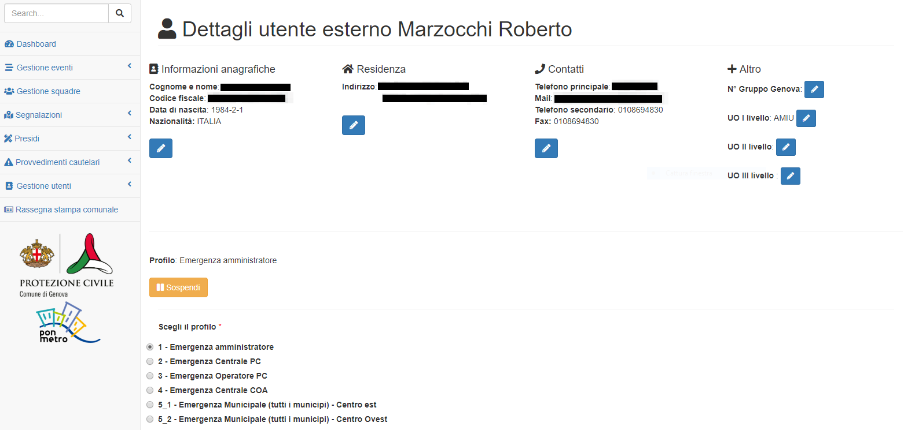

Funzionalità di gestione utenti
================================

Si tratta di quelle funzionalità utili per:

* creare nuovi utenti esterni;
* assegnare permessi a *utenti esterni* e  *dipendenti* (per i soli amministratori di sistema);
* gestire i contatti a cui notificare le mail (per i soli amministratori di sistema).

Funzionalità di creazione utenti esterni
-------------------------------------------------------------

Le funzionalità di creazione degli utenti avvengono tramite un apposito form che
replica il modulo cartaceo attualmente usato dalla Protezione Civile per la
registrazione dei volontari e, potrà essere condiviso con enti ed uffici
periferici, se necessario, per consentire una più agevole registrazione
degli utenti esterni.

Una volta registrati a sistema, gli utenti **non avranno nessun tipo di accesso al sistema**
in quanto la gestione dei permessi utente è in carico ai soli amministratori di sistema e
verrà spiegata nelle seguenti sezioni.

.. _richiesta-accesso:

Richiesta di accesso / rimozione permessi
-------------------------------------------------------------
Per la richiesta di accesso è necessario inviare una mail all' `amministratore di sistema`_  per richiedere l'attivazione del profilo utente. 

.. _amministratore di sistema: adminemergenzepc@comune.genova.it

Per tutti i richiedenti è necessario specificare:

* nome
* cognome
* CF 
* affiliazione

**Si ricorda che per gli utenti esterni è necessaria la registrazione utente (previo accreditamento con SPID) tramite la pagina https://emergenze.comune.genova.it/pages/add_volontario.php**

Assegnare permessi a *utenti esterni* e  *dipendenti*
-------------------------------------------------------------

Per assegnare/rimuovere i permessi ad un dipendente o ad un utente esterno è sufficiente:

* selezionare l'apposito tasto nel menù a sinistra;
* cercare la persona cui assegnare i permessi tramite nome e cognome;

.. image:: img/edit_profilo0.PNG

* assegnare / rimuovere il profilo corrispondente a quella persona (es. personale del municipio XY)

Gestire i contatti a cui notificare le mail
-------------------------------------------------------------

Per ogni unità operativa cui assegnare incarichi è necessario specificare una o più mail cui verranno
inviate le notifiche di sistema (vedi sopra).
Gli amministratori di sistema dovranno aggiornare i dati tramite l'apposita tabella di sistema.
Per ogni Unità Operativa si possono associare una o più mail.

**E' molto importante verificare periodicamente che i contatti mail inseriti a sistema siano aggiornati per evitare
falle nelle comunicazioni**.

